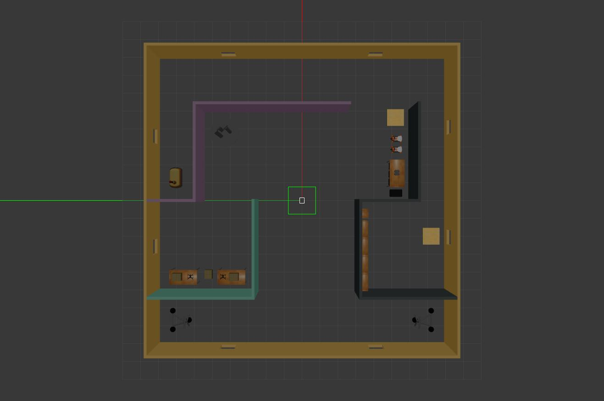

# RoboND-BuildMyWorld



## Project Overview

This project demonstrates custom world design and simulation in Gazebo, a powerful robotics simulation platform. A complete virtual environment has been designed featuring architectural elements, pre-built models, and a custom four-wheeled robot, all orchestrated through a C++ plugin system. This project is ideal for learning robot simulation fundamentals, world configuration, and Gazebo plugin development.

## Table of Contents

- [Features](#features)
- [System Requirements](#system-requirements)
- [Dependencies](#dependencies)
- [Project Structure](#project-structure)
- [Building the Project](#building-the-project)
- [Running the Simulation](#running-the-simulation)
- [Plugin Details](#plugin-details)
- [Troubleshooting](#troubleshooting)
- [License](#license)

## Features

- **Custom Gazebo World**: A fully-configured XML-based world environment
- **Architectural Environment**: Includes the `basic_office` structure with colored walls and furniture
- **Pre-built Models**: Integration of default Gazebo models for realistic scene composition
- **Custom Robot**: A four-wheeled robot model (`fw_robot`) for autonomous navigation testing
- **Welcome Plugin**: A C++ plugin that displays a welcome message when the simulation starts
- **Automated Build System**: CMake-based build process with convenient shell script launcher

## System Requirements

| Component | Requirement |
|-----------|-------------|
| **Operating System** | Linux (Unix or Unix-like systems) |
| **OS Version** | Ubuntu 20.04 LTS (tested and verified) |
| **Gazebo Version** | 11.x |
| **C++ Compiler** | GCC/G++ with C++11 support or later |
| **RAM** | Minimum 2 GB (4 GB recommended) |
| **Disk Space** | ~500 MB for dependencies and build artifacts |

## Dependencies

### Required

1. **CMake** (3.5.1 or later)
   - [Installation Instructions](https://cmake.org/install/)
   - Used for building the C++ plugin

2. **Gazebo** (Version 11.x)
   - [Installation Instructions](https://classic.gazebosim.org/tutorials?cat=install)
   - The primary simulation engine
   - Tested on Ubuntu 20.04 with Gazebo 11

### Optional

- **Git**: For cloning the repository
- **Catkin**: If integrating with ROS (Robot Operating System)

## Project Structure

```
02_BuildMyWorld/
├── CMakeLists.txt              # CMake configuration for building plugins
├── README.md                    # Project documentation (this file)
├── run.sh                       # Convenience script to build and launch
├── LICENSE                      # Primary license file
├── NOTICE                       # Attribution and notices
├── LICENSE.Apache-2.0           # Apache License 2.0 text
├── LICENSE.CC-BY-3.0            # Creative Commons CC BY 3.0 text
├── LICENSE.CC0-1.0              # CC0 1.0 Universal text
├── media/                       # Images and media files
│   └── gazebo_world.jpg        # Screenshot of the simulation world
├── models/                      # Gazebo model definitions
│   ├── basic_office/           # Custom architectural structure
│   ├── fw_robot/               # Custom four-wheeled robot model
│   ├── bookshelf/              # Standard Gazebo model
│   ├── cabinet/                # Standard Gazebo model
│   ├── cafe_table/             # Standard Gazebo model
│   ├── parrot_bebop_2/         # Standard Gazebo model
│   ├── youbot/                 # Standard Gazebo model
│   └── [other models]/         # Additional pre-built models
├── script/                      # C++ source files
│   └── welcome_message.cpp     # Plugin source code
└── world/
    └── myworld.world           # Main Gazebo world file (XML format)
```

**Note:** The `build/` directory is generated during the build process and is listed in `.gitignore`.

### Key Files Explained

- **`myworld.world`**: The main world configuration file (XML-based) that defines the environment, all objects, lighting, physics parameters, and the welcome_message plugin
- **`welcome_message.cpp`**: C++ source code for a Gazebo plugin that outputs a welcome message when the simulation initializes
- **`CMakeLists.txt`**: Build configuration that compiles `welcome_message.cpp` into the shared library `libwelcome_message.so`

## Building the Project

### Quick Build (Recommended)

The easiest way to build and launch the project is using the provided shell script:

```bash
# Make the script executable (only needed once)
chmod +x run.sh

# Build and run the simulation
./run.sh
```

This script will:
1. Generate a `build/` directory (if it doesn't exist)
2. Run CMake to configure the build system
3. Compile the welcome_message plugin
4. Launch Gazebo with the custom world

### Manual Build

If you prefer to build manually:

```bash
# Navigate to the project directory
cd /path/to/02_BuildMyWorld

# Set up and enter the build directory
mkdir -p build && cd build

# Configure the build with CMake
cmake ..

# Compile the plugin
make

# Return to project root
cd ..
```

### Build Output

After successful compilation, you'll find:
- **`build/libwelcome_message.so`**: The compiled plugin library (shared object)
- **Build logs**: Check `build/CMakeFiles/` for detailed compilation information

### Troubleshooting Build Issues

- **CMake not found**: Install CMake following the [official instructions](https://cmake.org/install/)
- **Gazebo headers not found**: Ensure Gazebo development packages are installed: `sudo apt install gazebo11-dev`
- **Compilation errors**: Verify your C++ compiler supports C++11: `g++ --version`

## Running the Simulation

### Launching the World

Once built, launch the simulation with:

```bash
./run.sh
```

Or manually:

```bash
# From the project root directory
gazebo world/myworld.world
```

### Expected Behavior

When the simulation starts, you should observe:

1. **Gazebo Window Opens**: The 3D visualization window displays the custom world
2. **Scene Elements**:
   - The `basic_office` structure with colored walls
   - Various furniture and objects (tables, bookshelves, cabinets)
   - The `fw_robot` (four-wheeled robot) positioned in the environment
   - Proper lighting and physics simulation
3. **Console Output**: A welcome message is printed to the terminal via the welcome_message plugin
4. **Physics**: Objects are subject to gravity and collision physics

### Interacting with the Simulation

- **Pan**: Right-click and drag to rotate the view
- **Zoom**: Scroll wheel or middle-click and drag vertically
- **Translate**: Left-click and drag to move the view
- **Pause/Play**: Use the controls in the Gazebo interface to pause or resume simulation
- **Insert Objects**: Use Gazebo's interface to add additional models from the model database

## Plugin Details

### Welcome Message Plugin

The `welcome_message` plugin is a Gazebo world plugin that demonstrates plugin system integration.

**Plugin Configuration in World File:**

```xml
<world name='default'>
  <plugin name='welcome_message' filename='libwelcome_message.so'/>
  <!-- ... rest of world configuration ... -->
</world>
```

**Plugin Features:**
- Inherits from `gazebo::WorldPlugin`
- Executes initialization code when the world loads
- Outputs a welcome message to standard output
- Demonstrates basic C++ plugin development with Gazebo

**Source Code:** See `script/welcome_message.cpp`

### World File Format

The `myworld.world` file is an XML document with the following structure:

```xml
<?xml version="1.0" ?>
<sdf version="1.7">
  <world name="default">
    <!-- Physics engine configuration -->
    <physics type="ode">...</physics>
    
    <!-- Lighting and camera setup -->
    <gui>...</gui>
    <scene>...</scene>
    
    <!-- Plugin declarations -->
    <plugin name='welcome_message' filename='libwelcome_message.so'/>
    
    <!-- Model includes and definitions -->
    <include>...</include>
    <model>...</model>
  </world>
</sdf>
```

## Troubleshooting

### Issue: Gazebo window doesn't open or crashes
- **Solution**: Ensure Gazebo 11 is properly installed: `gazebo -v`
- **Alternative**: Update your system: `sudo apt update && sudo apt upgrade`

### Issue: "libwelcome_message.so: cannot open shared object file"
- **Solution**: Rebuild the project: `./run.sh`
- **Verify**: Check that `build/libwelcome_message.so` exists

### Issue: Build fails with "CMake not found"
- **Solution**: Install CMake: `sudo apt install cmake`
- **Verify**: Check installation: `cmake --version`

### Issue: Gazebo models fail to load
- **Solution**: Ensure Gazebo model database is accessible
- **Check**: Run `gazebo` independently to verify the installation
- **Reset**: Delete Gazebo cache: `rm -rf ~/.gazebo`

### Issue: Slow performance or high CPU usage
- **Solution**: Reduce graphics quality in Gazebo settings
- **Alternative**: Ensure sufficient system resources are available (8+ GB RAM recommended)

### Getting Help

- Check Gazebo's official [troubleshooting guide](https://classic.gazebosim.org/tutorials?tut=troubleshooting)
- Review Gazebo [plugin development documentation](https://classic.gazebosim.org/tutorials?tut=plugins_world)
- Examine the CMake build output for specific error messages

## License

This repository contains material under multiple licenses. Please review the relevant license files before use or modification.

| Component | License | File |
|-----------|---------|------|
| `script/welcome_message.cpp`, `CMakeLists.txt` | Apache License 2.0 | `LICENSE.Apache-2.0` |
| `world/myworld.world` | CC BY 3.0 | `LICENSE.CC-BY-3.0` |
| Gazebo models in `models/` (except noted) | CC BY 3.0 | `LICENSE.CC-BY-3.0` |
| Original docs, images, `run.sh`, custom models | CC0 1.0 | `LICENSE.CC0-1.0` |

**Full License Details:**
- `script/welcome_message.cpp` and `CMakeLists.txt` include or derive from Gazebo example code and are licensed under Apache License 2.0.
- `world/myworld.world` is licensed under Creative Commons Attribution 3.0 Unported (CC BY 3.0).
- Imported or adapted Gazebo models/assets in `models/` are licensed under Creative Commons Attribution 3.0 Unported (CC BY 3.0), except where otherwise noted.
- Original documentation, original images, `run.sh`, and original models authored for this repository are licensed under CC0 1.0 unless otherwise noted.

**License Files:**
- `LICENSE` - Primary license information
- `NOTICE` - Attribution and notices
- `LICENSE.Apache-2.0` - Full Apache License 2.0 text
- `LICENSE.CC-BY-3.0` - Full CC BY 3.0 text
- `LICENSE.CC0-1.0` - Full CC0 1.0 Universal text
